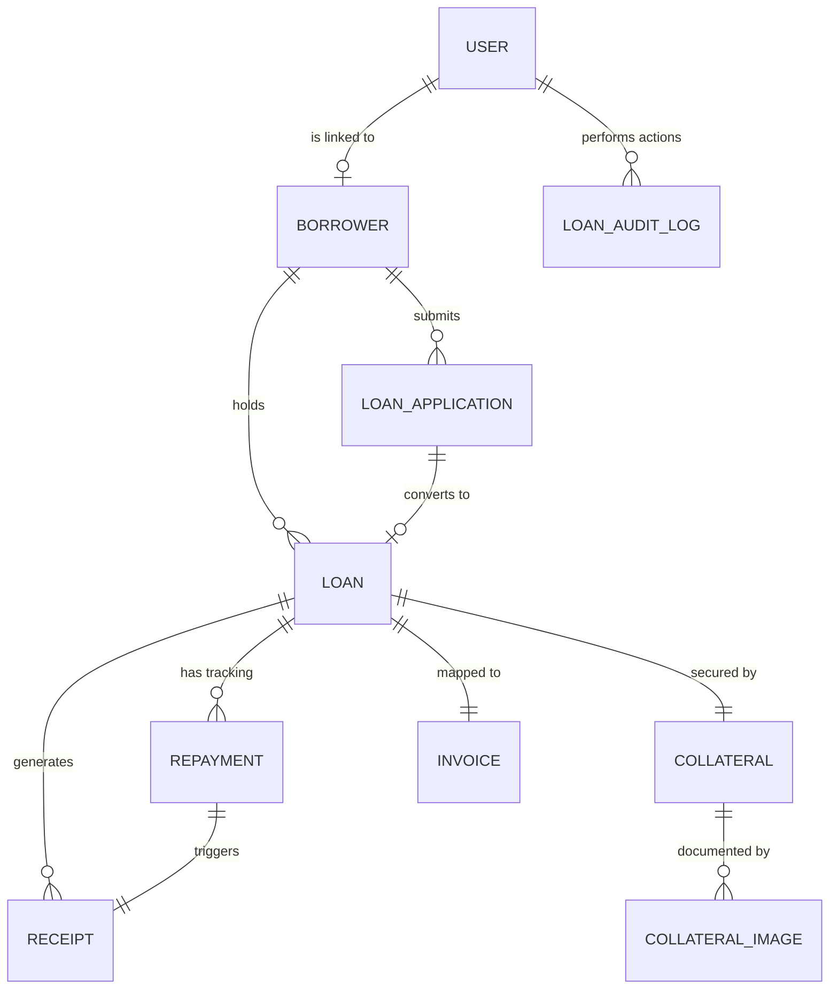

# Entity Relationship Documentation (ERD Map)

## 1. Diagram (Logical Flow)

## 2. Model Mapping Matrix
| Model | Primary Key | Foreign Keys | Key Constraints |
| :--- | :--- | :--- | :--- |
| **LoanApplication** | `id` | `borrowerId` | `applicationCode` (Unique) |
| **Borrower** | `id` | `userId` | `borrowerCode`, `nationalId` (Unique) |
| **Loan** | `id` | `borrowerId`, `applicationId` | `loanCode` (Unique) |
| **Collateral** | `id` | `loanId` | `collateralCode` (Unique) |
| **Repayment** | `id` | `loanId` | `repaymentCode` (Unique) |
| **Invoice** | `id` | `loanId` | `invoiceNumber` (Unique) |
| **Receipt** | `id` | `loanId` | `receiptNumber` (Unique) |

## 3. Audit & State Management
Transactions are logged in `LoanAuditLog` which captures:
- `actionType`: (e.g., "DISBURSEMENT_RECORDED")
- `oldValue` / `newValue`: JSON snapshots of the record state before/after the operation.
- `timestamp`: Precise clock-in of the event.
